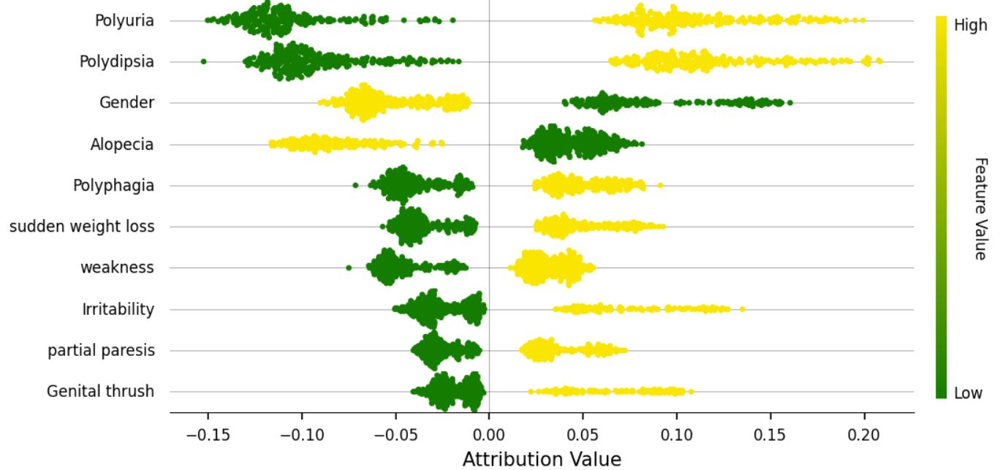
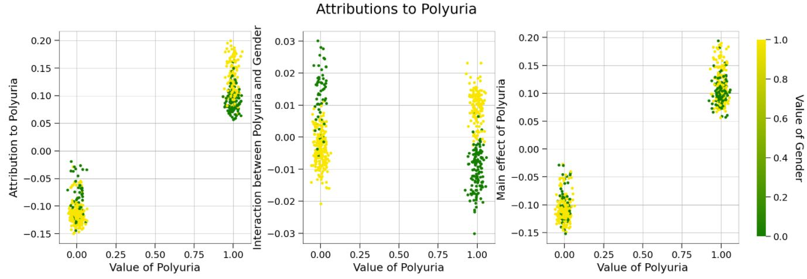
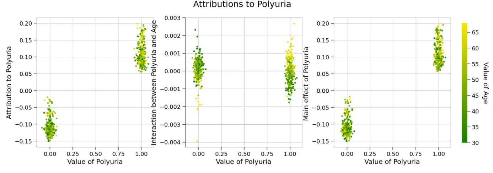
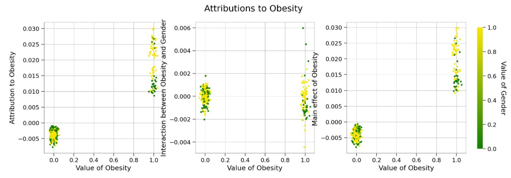

# path_explain_diabetes_torch
Pytorch example of path-explain using Pytorch

# Path Explain

A repository used for explaining feature importances and feature interactions in deep neural networks using path attribution methods.

This repository contains tools to interpret and explain machine learning models using [Integrated Gradients](https://arxiv.org/abs/1703.01365) and [Expected Gradients](https://arxiv.org/abs/1906.10670). In addition, it contains code to explain _interactions_ in deep networks using Integrated Hessians and Expected Hessians - methods that the authors introduced in their most recent paper: ["Explaining Explanations: Axiomatic Feature Interactions for Deep Networks"](https://www.jmlr.org/papers/v22/20-1223.html).

The Pytorch implementation for path-explain can be found in `path_explain/explainer` directory in the offcial [repository](https://github.com/suinleelab/path_explain). They only provide examples on tensorflow models thus this is useful for those who primarily work with pytorch. 

**CAVEAT : PIP INSTALLATION OF PATH_EXPLAIN DOES NOT INCLUDE PYTORCH IMPLEMENTATION OF PATH-EXPLAIN.**

### Tabular Data using Expected Gradients and Expected Hessians

The repository can easily be adapted to explain attributions and interactions learned on tabular data.
```python
# other import statements...
from path_explain.path_explain.explainers.path_explainer_torch import PathExplainerTorch

### Code to train a model would go here
x_train, y_train, x_test, y_test = diabetes_datset()
model = ...
optimizer = optim.SGD(model.parameters(), lr=...)
loss_fn = nn.BCELoss()

### Training Loop
def train(model, optimizer, loss_fn):

  for epoch in range(...):
    running_loss = 0.0
    for batch_idx, (feature, label) in enumerate(train_loader):

      optimizer.zero_grad()
      predictions = model.forward(feature)
      loss = loss_fn(...)

      loss.backward()
      optimizer.step()
      running_loss += loss.item()
      .....
  print('Trained!')


### Generating attributions using expected gradients
explainer = PathExplainerTorch(model)
all_data = torch.cat([x_train_tensor, x_test_tensor], axis=0)
all_data.requires_grad = True  
attributions = explainer.attributions(input_tensor=all_data,
                                      baseline=x_train_tensor,
                                      num_samples = 200,
                                      use_expectation=True,
                                      output_indices = 0
                                      )
###

### Generating interactions using expected hessians
interactions = explainer.interactions(input_tensor = all_data,
                                      baseline=x_train_tensor,
                                      num_samples=200,
                                      use_expectation=True,
                                      output_indices=0,
                                      verbose=True)
###
```

Once we've generated attributions and interactions, we can use the provided plotting modules to help visualize them. First we plot a summary of the top features and their attribution values:
```python
### First we need a list of strings denoting the name of each feature
feature_names = ...
###

summary_plot(numpy_attributions,
             all_data_renorm,
             interactions=None,
             interaction_feature=None,
             feature_names=feature_names,
             plot_top_k=10)
```


Second, we plot an interaction our model has learned between maximum achieved heart rate and gender:
```python
fig, axs = scatter_plot(numpy_attributions,
                        all_data_renorm,
                        feature_index='Polyuria',
                        interactions=numpy_interactions,
                        color_by='Gender',
                        feature_names=feature_names,
                        scale_y_ind=True,
                        add_random_noise_x=True)
```







The model used to generate the above interactions is a two layer neural network trained on the Diabetes Dataset. To learn more about this particular model and the experimental setup, see [the notebook used to train and explain the model](https://github.com/suinleelab/path_explain/blob/master/examples/tabular/heart_disease/attributions.ipynb).


